```{r setup, include=FALSE}
knitr::opts_chunk$set(echo = TRUE)
```

## **Abstract**

MECOM ha sido propuesto como un regulador clave del potencial regenerativo en células madre neurales retinianas humanas. Con el objetivo de evaluar su función, se realizó un análisis de expresión génica diferencial mediante *bulk RNA-seq* en organoides retinianos humanos, comparando muestras control tipo salvaje con organoides con knockout de MECOM.

El procesamiento de datos incluyó la descarga de lecturas mediante *Wget*, evaluación de calidad con *FastQC,* corrección de errores utilizando *Rcorrector*, filtrado y recorte de secuencias con *Trimmomatic,* alineamiento al genoma de referencia mediante *STAR* y cuantificación de lecturas. El análisis de expresión diferencial se realizó con *DESeq2,* mientras que el análisis funcional y de enriquecimiento biológico se llevó a cabo con *clusterProfiler.*

Los resultados mostraron una clara separación entre las condiciones WT y KO y confirmaron una reducción significativa en la expresión de *MECOM*. Asimismo, se identificó una disminución en genes asociados con funciones visuales, desarrollo retiniano y mantenimiento de tipos celulares de la retina, mientras que los genes sobreexpresados se relacionaron con procesos de desarrollo embrionario y morfogénesis. En conjunto, estos hallazgos respaldan el papel de *MECOM* como un regulador importante de programas transcripcionales asociados con la identidad celular y el potencial regenerativo de la retina.

## **Introducción**

Las terapias contra la degeneracion de retina basadas en celulas requieren del concocimiento de grupos celulares con alta capacidad de diferenciacion y de autorenvacón, es decir, células pluripotentes. En el articulo *"Identificación y caracterización de células madre de la retina humana capaces de regeneración retiniana"* en el cual se basa este análisis de RNA-seq Bulk, se demostró que las células madre neurales retinianas humanas tipo stem (hNRSCs) presentan perfiles moleculares distintos a los de las células progenitoras retinianas (RPCs) normales. Esto se debe a que expresan genes caracteristicos de las celulas madre como *MECOM, COL9A1 y CPAMD8*, y se localizan específicamente en la zona marginal ciliar (CMZ) , un nicho periférico de la retina correspondinete a la región no pigmentada (Liu et al., 2025).

Entre los reguladores transcripcionales asociados a estas células, *MECOM* fue identificado como un factor clave para la proliferación, diferenciación y reparación retinal. Para explorar su función génica en las hNRSC y su papel en la reparación de organoides de retina humana, se utilizó la tecnología de *CRISPR-Cas9* para inducir la inactivacion de MECOM (knockout). Postriormente se realizó un análisis comparativo de la expresión génica y funcional (RNA-seq Bulk) entre:

-   Control -\> Organoides de retina tipo wild type (WT)

-   Caso -\> Organoides con knockout de MECOM (KO)

Para este proyecto se reproducirá un análisis de expresión génica mediante la técnica de *bulk RNA-seq*, utilizando datos de secuenciación de ARN obtenidos a partir de organoides retinianos humanos. Las muestras fueron secuenciadas mediante la plataforma Illumina HiSeq 4000 y presentan una profundidad de secuenciación aproximada de entre 20 y 30 millones de lecturas por muestra. Asimismo, corresponden a lecturas *paired-end unstranded* y fueron preparadas mediante un método de enriquecimiento de ARN mensajero basado en la selección de colas poli(A).

El estudio incluye un total de seis muestras biológicas, distribuidas en dos condiciones experimentales: tres muestras control y tres muestras con inactivación de MECOM (n = 3 por grupo). Los datos serán obtenidos de la base de datos del National Center for Biotechnology Information (NCBI) y corresponden al estudio previamente descrito.

**NCBI Link:** <https://www.ncbi.nlm.nih.gov/geo/query/acc.cgi?acc=GSE279113>

**Bioproject:** PRJNA1170898

## **Resultados**

### *Flujo de trabajo*

El procesamiento y análisis de los datos de RNA-seq Bulk se realizó mediante un flujo de trabajo bioinformático que incluyó etapas de descarga de datos, control de calidad, corrección de errores, filtrado de lecturas, alineamiento al genoma de referencia, análisis de expresión diferencial y enriquecimiento funcional. Las herramientas empleadas en cada etapa se muestran en la Figura 1.

```{r, echo=FALSE, fig.cap="Figura 1. Pipeline de análisis bioinformático empleado para el procesamiento y análisis de datos de bulk RNA-seq.", fig.align='center', out.width='100%'}
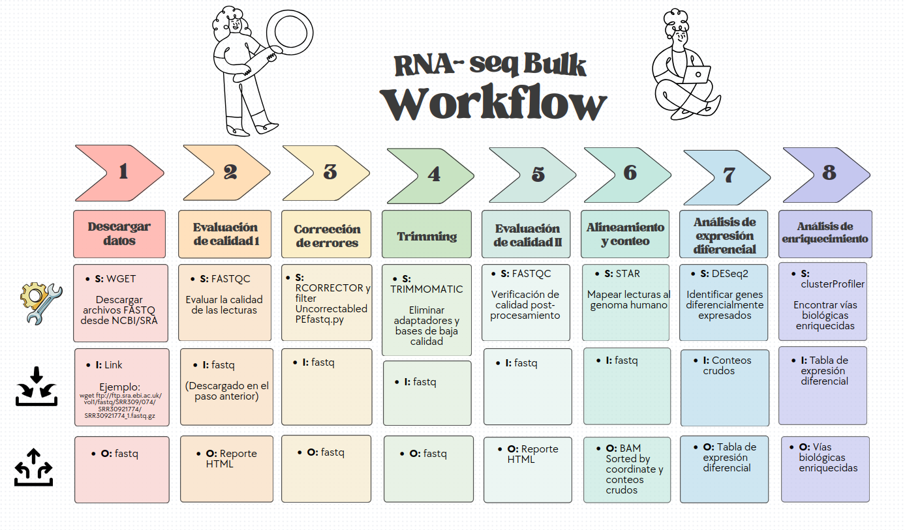
```

### *Calidad de las secuencias*

Como primer paso, se realizó un análisis de control de calidad de las muestras descargadas mediante FastQC, con el objetivo de evaluar la calidad de las secuencias obtenidas. Para ello, se utilizó el siguiente código:

El archivo de script correspondiente al job se localiza en la siguiente ruta: /mnt/data/transcriptomica/vmartinez/proyecto_final/02_fastqc_raw/scripts/02_fastqc_raw.slurm

```{bash}
#-------------- Run FastQC --------------

for sample in "${samples[@]}"
do

    echo "Processing ${sample}"

    fastqc \
        ${INPUT_DIR}/${sample}_1.fastq.gz \
        ${INPUT_DIR}/${sample}_2.fastq.gz \
        --outdir ${OUTPUT_DIR} \
        --threads 8

done

echo "FastQC finished"
```

En general, las lecturas de todas las muestras presentaron una alta calidad antes de la corrección de errores. Sin embargo, algunos módulos de FastQC, como *Per Base Sequence Content*, *Sequence Duplication Levels* y *Kmer Content*, presentaron advertencias o indicadores de baja calidad. Estos resultados son comunes en experimentos de RNA-seq y pueden estar asociados con sesgos introducidos durante la preparación de la biblioteca, el contenido de transcritos o altamente expresados.

```{r, echo=FALSE, results='asis'}
cat('
<div style="display:flex; justify-content:center; gap:30px;">

<div style="text-align:center;">
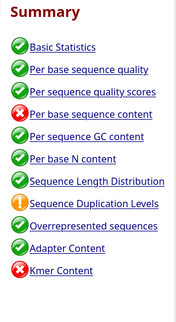
<p><b>Figura 2A.</b> Control de calidad inicial (QC1) antes del trimming.</p>
</div>

<div style="text-align:center;">
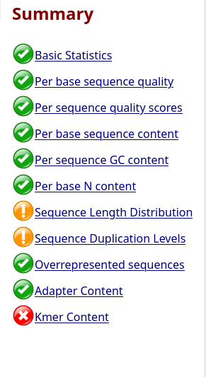
<p><b>Figura 2B.</b> Control de calidad posterior al trimming (QC2).</p>
</div>

</div>
')
```

Además, se utilizó MultiQC para integrar y visualizar los reportes generados durante el proceso de control de calidad, juntando los reportes en un único informe los resultados de los 12 archivos FASTQ previamente analizados. Esta herramienta permite resumir y comparar de manera conjunta las métricas de calidad obtenidas para todas las muestras.

El reporte mostró que las muestras presentaron una longitud de lectura uniforme de 150 pb y un contenido de GC estable, entre 48 % y 50 %. Asimismo, la profundidad de secuenciación se encontró entre 20.6 y 31.8 millones de lecturas por archivo, lo que indica una cobertura adecuada.

Sin emabargo, se observaron las mismas advertencias (*warnings*) en los módulos *Per Base Sequence Content* y *Sequence Duplication Levels,* como en los FASTQC por separado. El primero presentó desviaciones en la proporción de nucleótidos en las lecturas, aunque es algo esperado en experimentos de RNA-seq debido a sesgos introducidos durante la preparación de bibliotecas. Por otro lado, el módulo *Sequence Duplication Levels* tamien mostró niveles altos de duplicación entre 38.5 % y 50.9 %, aunque estos valores pueden presentar advertencias en FastQC, son esperados en estudios de RNA-seq debido a la presencia de transcritos altamente expresados que producen múltiples lecturas idénticas.

En conjunto, las métricas obtenidas indican que las muestras presentan una calidad adecuada para continuar con los análisis de alineamiento.

```{r, echo=FALSE, results='asis'}
cat('
<div style="display:flex; justify-content:center; gap:30px;">

<div style="text-align:center;">
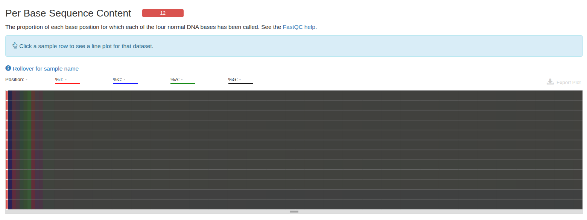
<p><b>Figura 3A.</b> Per base sequence content MULTIQC.</p>
</div>

<div style="text-align:center;">
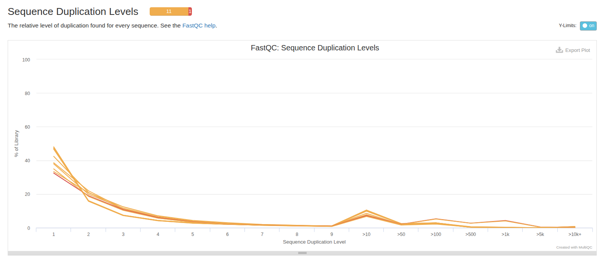
<p><b>Figura 3B.</b> Sequence duplication levels MULTIQC.</p>
</div>

</div>
')
```

Después del proceso de *trimming* se observaron mejoras en la calidad de las lecturas. En particular, el módulo *Per Base Sequence Content* mostró inicialmente variaciones en la proporción de las bases nucleotídicas (A, T, C y G) durante aproximadamente los primeros 10 nucleótidos (figura 3A). Esta problema disminuyó considerablemente tras el preprocesamiento, como se mostró en el segundo control de calidad (QC2), donde se observa una distribución más uniforme de nucleótidos en todas las muestras de ambos grupos experimentales (Fig3B).

```{r, echo=FALSE, results='asis'}
cat('
<div style="display:flex; justify-content:center; gap:30px;">

<div style="text-align:center;">
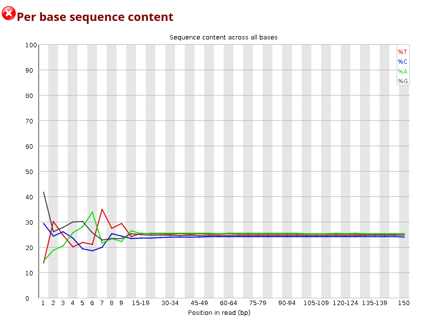
<p><b>Figura 4A.</b> Per base sequence content antes del trimming (QC1).</p>
</div>

<div style="text-align:center;">
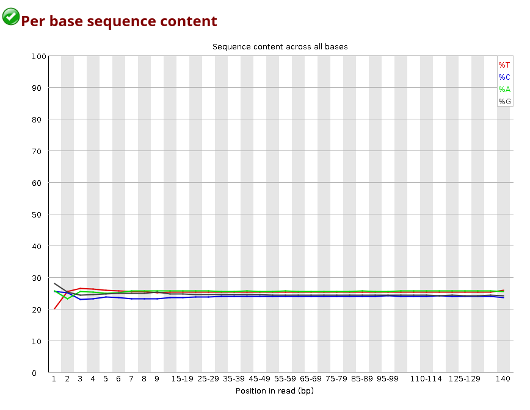
<p><b>Figura 4B.</b> Per base sequence content posterior al trimming (QC2).</p>
</div>

</div>
')
```

Por otra parte, el módulo *Sequence Duplication Levels* mostró niveles moderados de duplicación, sin embargo, esto es un aviso esperado en experimentos de RNA-seq debido a la presencia de transcritos altamente expresados que generan múltiples lecturas idénticas. Por lo tanto, a pesar de las dos fases de control de calidad y correciones, este módulo mantiene su estado de warning.

Una observación importante de este reporte es que el módulo *Sequence Length Distribution* pasó de presentar una calidad excelente a mostrar una advertencia, indicando una mayor variabilidad en la longitud de las lecturas (Fig4A y Fig4B). A pesar de ello, este resultado es esperado tras la aplicación de Trimmomatic ya que, durante el proceso se eliminan adaptadores y bases de baja calidad en los extremos de las secuencias. Como consecuencia, algunas lecturas son recortadas en mayor medida que otras, generando una distribución de longitudes más heterogénea. Sin embargo, este comportamiento es normal en datos procesados mediante *trimming* y no compromete la calidad análisis posteriores.

```{r, echo=FALSE, results='asis'}
cat('
<div style="display:flex; justify-content:center; gap:30px;">

<div style="text-align:center;">
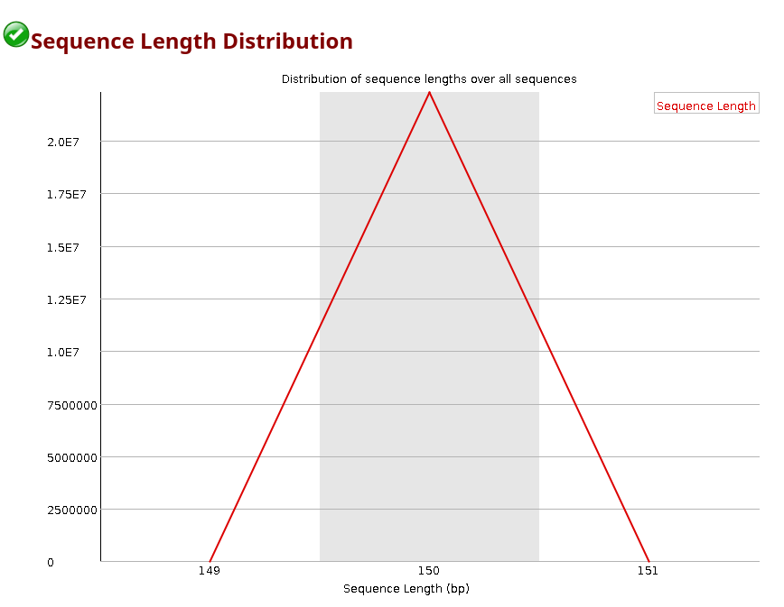
<p><b>Figura 5A.</b> Sequence length distribution antes del trimming (QC1).</p>
</div>

<div style="text-align:center;">
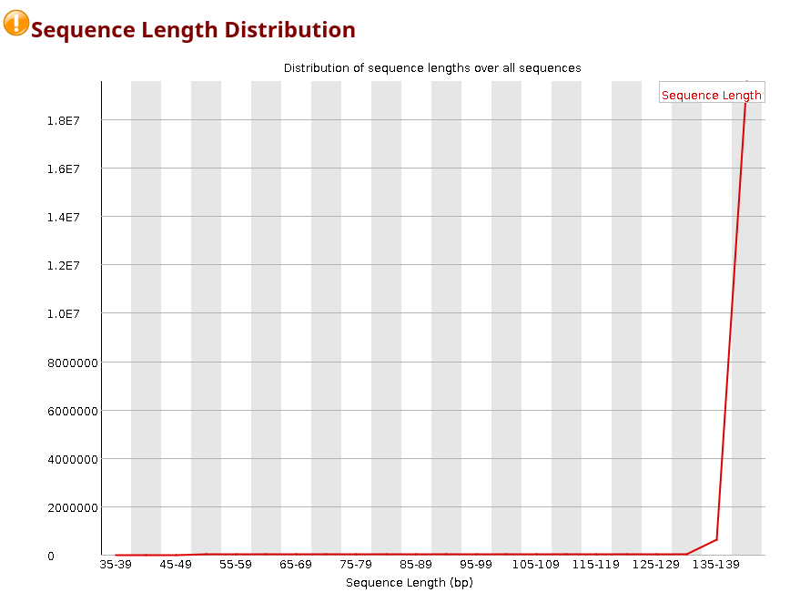
<p><b>Figura 5B.</b> Sequence length distribution  posterior al trimming (QC2).</p>
</div>

</div>
')
```

Finalmente notamos que el módulo *Kmer Content* continuó mostrando secuencias enriquecidas después del proceso de trimming e incluso presentó un incremento en algunos picos específicos (Fig 5B). Este comportamiento puede atribuirse a cuando Trimmomatic recorta los extremos de las lecturas, muchas secuencias comienzan o terminan en posiciones similares. Esto puede provocar que ciertos k-mers se vuelvan relativamente más frecuentes.

Dado que no se detectó contenido significativo de adaptadores y que las métricas generales de calidad mejoraron, este resultado no se considera una limitante para continuar con los análisis posteriores.

```{r, echo=FALSE, results='asis'}
cat('
<div style="display:flex; justify-content:center; gap:30px;">

<div style="text-align:center;">
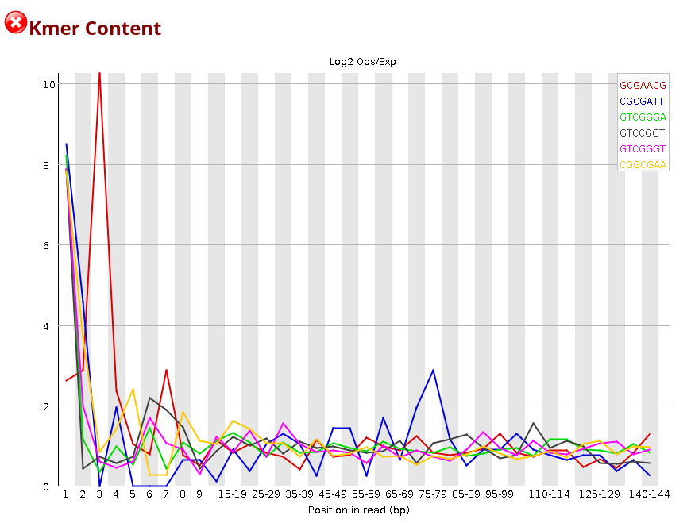
<p><b>Figura 6A.</b> Sequence length distribution antes del trimming (QC1).</p>
</div>

<div style="text-align:center;">
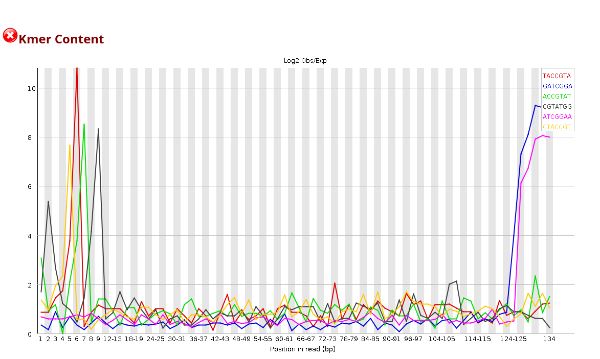
<p><b>Figura 6B.</b> Sequence length distribution  posterior al trimming (QC2).</p>
</div>

</div>
')
```

Nota: Con fines de simplificación, solo se presenta la comparación entre el QC inicial y el QC posterior al trimming para una de las muestras analizadas, debido a que el comportamiento observado y las métricas de calidad fueron similares en el resto de las muestras.

De igual manera, posterior al trimming la calidad de las lecturas procesadas se evaluó utilizando MultiQC. Y los sumarizados mostraron de igual forma una reducción significativa del contenido de adaptadores y de las secuencias sobrerepresentadas, observándo menos del 1% de lecturas asociadas a este tipo de secuencias. Asimismo, las métricas generales de calidad se mantuvieron dentro de rangos adecuados para continuar con el análisis. Aunque persistieron los warnings en los módulos *Per Base Sequence Content* y *Sequence Duplication Levels* estos comportamientos son frecuentes en experimentos de RNA-seq por razones previamente mencionadas. En conjunto, los resultados obtenidos indican que el proceso de trimming mejoró la calidad de las lecturas y eliminó posibles artefactos técnicos, permitiendo proceder con mayor confianza a las etapas de alineamiento y cuantificación de la expresión génica.

```{r, echo=FALSE, results='asis'}
cat('
<div style="display:flex; justify-content:center; gap:30px;">

<div style="text-align:center;">
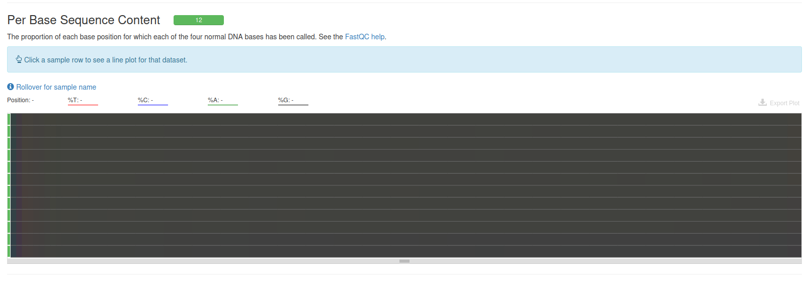
<p><b>Figura 7A.</b> Per base sequence content MULTIQC posterior al trimming.</p>
</div>

<div style="text-align:center;">
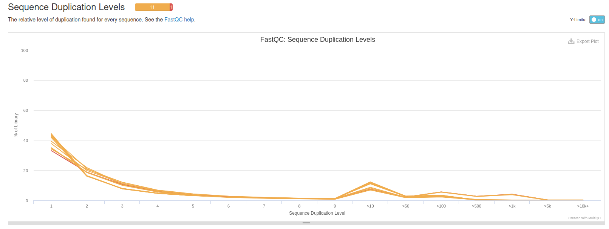
<p><b>Figura 7A.</b> Sequence duplication levels MULTIQC posterior al trimming.</p>
</div>

</div>
')
```

### *Limpieza de adaptadores*

Antes del proceso de trimming, las lecturas fueron sometidas a una corrección de errores mediante *Rcorrector*, con el objetivo de identificar y corregir errores de secuenciación basados en la frecuencia de k-mers. Posteriormente, las lecturas marcadas como no corregibles fueron eliminadas utilizando *FilterUncorrectabledPEfastq.py*, conservando únicamente secuencias de alta confiabilidad. Finalmente, las lecturas filtradas fueron procesadas con *TRIMMOMATIC* para eliminar adaptadores y bases de baja calidad, garantizando así datos adecuados para el alineamiento al genoma de referencia.

``` bash
echo "==============================="
echo "STEP 2 — TRIMMOMATIC"
echo "==============================="

for sample in "${samples[@]}"
do

echo "Running Trimmomatic for ${sample}"

trimmomatic PE \
-threads 16 \
${RCORRECTOR_DIR}/${sample}_1.cor.fq \
${RCORRECTOR_DIR}/${sample}_2.cor.fq \
${TRIM_DIR}/${sample}_1.paired.fastq.gz \
${TRIM_DIR}/${sample}_1.unpaired.fastq.gz \
${TRIM_DIR}/${sample}_2.paired.fastq.gz \
${TRIM_DIR}/${sample}_2.unpaired.fastq.gz \
ILLUMINACLIP:${ADAPTERS}:2:30:10 \
LEADING:3 \
TRAILING:3 \
SLIDINGWINDOW:4:25 \
MINLEN:50 \
HEADCROP:10

done
```

Durante el proceso de trimming se realizaron los siguientes procesos:

1.  `ILLUMINACLIP:${ADAPTERS}:2:30:10` -\> Eliminación de adaptadores
2.  `LEADING:3` -\> Eliminación de bases de calidad menor a 3 al inicio
3.  `TRAILING:3` Eliminación de bases con calidad menor a 3 al final
4.  `SLIDINGWINDOW:4:25` -\> Analiza ventantas de 4 bases, si la calidad es \<25, se corta la lectura desde ese punto
5.  `MINLEN:50` -\> Descarta lecturas que despues del trimming quedaron con \<50bp
6.  `HEADCROP:10` -\> Recorte de los primeros 10 nucleotidos

``` bash
echo "==============================="
echo "STEP 3 — FASTQC TRIMMED"
echo "==============================="

for sample in "${samples[@]}"
do

echo "Running FastQC trimmed for ${sample}"

fastqc -t 8 \
${TRIM_DIR}/${sample}_1.paired.fastq.gz \
${TRIM_DIR}/${sample}_2.paired.fastq.gz \
-o ${FASTQC_TRIM_DIR}

done
```

Una vez completado el proceso de *trimming* y la eliminación de adaptadores, se realizó un segundo control de calidad *FastQC trimmed* para evaluar el impacto del preprocesamiento sobre las lecturas. Como se explicó previamente, el módulo *Per Base Sequence Content* mostró una distribución más uniforme de nucleótidos, mostrando una reducción de las observaciones anormales en los extremos de las secuencias. Asimismo, aunque el módulo *Kmer Content* continuó presentando advertencias, este comportamiento puede atribuirse al enriquecimiento de ciertos k-mers tras el recorte de las lecturas, no siendo una limitante para los análisis posteriores.

En conjunto, estos resultados indican que la eliminación de adaptadores y bases de baja calidad mejoró la calidad general de las muestras, proporcionando lecturas más confiables para las etapas posteriores de alineamiento y análisis transcriptómico.

### *Alineamiento y conteo*

Posterior a los controles de calidad y correcciones de las lecturas de las muestras, es turno de alinearlas al genoma de referencia humano y la preparacion de los archivos para los analisis posteriores.

Para ejecutar los alineamientos, se creó un archivo job independiente para cada muestra. Dichos archivos se encuentran almacenados en la siguiente ruta:

/mnt/data/transcriptomica/vmartinez/proyecto_final/06_alignment_and_counts/scripts

A continuación, se presenta un fragmento del código empleado en estos scripts:

``` bash
# Add any modules you might require:
module load star/2.7.9a

# here.
#
#SBATCH -p node
#SBATCH --cpus-per-task=16
#SBATCH --mem=32G
#SBATCH --time=72:00:00
##
# Write your commands in the next line

cd /mnt/data/transcriptomica/vmartinez/proyecto_final/06_alignment_and_counts

STAR \
--genomeDir /mnt/data/transcriptomica/vmartinez/proyecto_final/index_star \
--readFilesIn /mnt/data/transcriptomica/vmartinez/proyecto_final/04_trimmomatic/SRR30921769_1.paired.fastq.gz /mnt/data/transcriptomica/vmartinez/proyecto_final/04_trimmomatic/SRR30921769_2>
--outFileNamePrefix SRR30921769_ \
--outSAMtype BAM SortedByCoordinate \
--quantMode GeneCounts \
--readFilesCommand zcat
```

Posteriormente, las lecturas filtradas fueron alineadas contra el genoma de referencia humano GRCh38 utilizando la herramienta STAR (Spliced Transcripts Alignment to a Reference). Para ello, se emplearon los archivos FASTQ generados tras el proceso de trimming y un índice genómico previamente construido.

Como resultado del alineamiento, STAR generó archivos BAM ordenados por coordenadas genómicas, los cuales contienen la posición de cada lectura sobre el genoma de referencia. Adicionalmente, mediante la opción *GeneCounts*, se obtuvieron los conteos de lecturas asignadas a cada gen, información que fue utilizada posteriormente para el análisis de expresión diferencial.

Con el fin de automatizar el procesamiento, se creó un archivo job independiente para cada muestra analizada, permitiendo ejecutar los alineamientos de manera reproducible.

### *Expresión diferencial*

```{r, echo = FALSE, results = 'hide', message = FALSE, warning=FALSE}
# #Cargamos librerias 
# library(DESeq2)
# library(ComplexHeatmap)
# library(ggplot2)
# library(pheatmap)
# library(RNAseqQC)
# library(ensembldb)
# library(dplyr)
# library(purrr)
# library(magrittr)
# library(EnhancedVolcano)
# library(RColorBrewer)
# library(AnnotationDbi)
# library(tidyr)
# library(tibble)
# library(rnaseqGene)
# library(stringr)
# library(apeglm)
# library(limma)
# library(vegan)
# library(SummarizedExperiment)
# library(ggplot2)
# library(pheatmap)
# library(dplyr) 
# library(ggrepel)
# library(org.Hs.eg.db)
```

##### *Construccion de matriz de conteos*

1.  Cargamos nuestro directorio de trabajo

En esta sección se establece el directorio de trabajo. Posteriormente, se obtienen las rutas de todos los archivos de conteos generados por STAR, los cuales serán utilizados en los análisis posteriores.

```{r, echo = TRUE, results = 'hide', message = FALSE, warning=FALSE}
# directory <- "./counts"
# setwd(directory)
# sampleFiles <- list.files(directory, pattern="*.out.tab")
```

2.  Lectura y procesamiento de los archivos de conteos

En esta sección se leen todos los archivos de conteos generados por STAR. Para cada archivo, se eliminan las primeras cuatro filas que contienen información de resumen y no corresponden a genes. Posteriormente, se extrae el identificador de la muestra (SRR) a partir del nombre del archivo.

Finalmente, se conservan únicamente las columnas correspondientes al identificador del gen y a los conteos unstranded, renombrando la columna de conteos con el nombre de la muestra para facilitar su integración en una matriz de expresión.

```{r, echo = TRUE, results = 'hide', message = FALSE, warning=FALSE}
# 
# count_list <- lapply(sampleFiles, function(file){
#   df <- read.delim(
#     file,
#     header = FALSE,
#     skip = 4
#   )
#   sample_name <- sub(
#     "alignment_(SRR[0-9]+)_ReadsPerGene.out.tab",
#     "\\1",
#     basename(file)
#   )
#   counts_df <- data.frame(
#     Geneid = df$V1,
#     counts = df$V2
#   )
#   colnames(counts_df)[2] <- sample_name
#   
#   return(counts_df)
# }) 

```

3.  Construcción de la matriz de conteos

En esta sección se integran los conteos de todas las muestras en una sola tabla, utilizando el Geneid. Posteriormente, los Geneids de los genes se asignan como nombres de fila y se elimina la columna. Finalmente, la tabla se convierte en la matriz de conteos.

```{r, echo = TRUE, results = 'hide', message = FALSE, warning=FALSE}
 
# count_table <- Reduce(function(x, y){
#   
#   full_join(x, y, by = "Geneid")
#   
# }, count_list)
# 
# rownames(count_table) <- count_table$Geneid
# 
# count_table <- count_table[, -1]
# 
# count_matrix <- as.matrix(count_table)
# 
# mode(count_matrix) <- "integer" 

```

##### *Construccion del objeto dds*

1.  Cargar Sample table

En esta sección cargamos el sample table, la cual contiene el identificador de cada muestra y la condición experimental a la que pertenece. Esta es una tabla importante para el diseño experimental en DESeq2.

```{r}
# sampletable <- read.csv("./sample_table.csv")
# sampletable$condition <- as.factor(sampletable$condition) 
# rownames(sampletable) <- sampletable$sample
```

2.  Construcción del objeto DDS

En este paso se integran los conteos crudos y la sample table en un único objeto DDS. El diseño \~ condition indica que las diferencias de expresión se modelarán según la condición experimental asignada a cada muestra, permitiendo posteriormente comparar los grupos de interés.

```{r}
# dds <- DESeqDataSetFromMatrix(
#   countData = count_matrix,
#   colData = sampletable,
#   design = ~ condition
# ) 
```

##### *Filtrar genes con conteos bajos*

En esta sección se eliminan los genes con niveles de expresión muy bajos, ya que suelen aportar poca información al análisis estadístico y pueden incrementar el ruido en los resultados. Se conservan únicamente aquellos genes que presentan al menos 10 lecturas en un mínimo de tres muestras.

```{r}
# smallestGroupSize <- 3
# keep <- rowSums(counts(dds) >= 10) >= smallestGroupSize
# dds <- dds[keep,]
# dds
```

##### *Definimos la referencia*

En esta sección se establece el grupo control como nivel de referencia para el análisis de expresión diferencial. De esta forma, los cambios de expresión estimados por DESeq2 se interpretarán con respecto a la condición control.

```{r}

# dds$condition <- relevel(dds$condition, ref = "control") 
# any(is.na(dds$control))
# any(is.na(dds$MECOM_KO))

```

##### *Correr DESeq*

En esta sección se ejecuta DESeq. En esta funcion se estiman los factores de normalización entre muestras, se calcula la dispersión de cada gen y ajusta un modelo estadístico para evaluar las diferencias de expresión entre las condiciones experimentales definidas en el diseño.

```{r}
# dds <- DESeq(dds)
```

##### *Guardar resultados de DESeq*

En esta sección se extraen los resultados del análisis de expresión diferencial realizado por DESeq2. Posteriormente, los genes se ordenan de acuerdo con su valor p ajustado, de modo que los genes más significativamente diferencialmente expresados aparezcan al inicio de la tabla.

```{r}
# res <- results(dds)
# res  
# 
# res<-res[order(res$padj),]
```

##### *Anotar resultados de DESeq*

En esta sección se enriquecen los resultados obtenidos con DESeq2 mediante información biológica proveniente de la base de datos org.Hs.eg.db. A partir de los identificadores Ensembl de cada gen, se recuperan diferentes anotaciones, incluyendo el gene symbol, el identificador Entrez, términos de Gene Ontology (GO) y rutas biológicas asociadas. Finalmente se exportan a un archivo CSV.

```{r}
# deseq_Results<-res 
# head(deseq_Results)
# row.names(deseq_Results)
# 
# columns(org.Hs.eg.db) 
# 
# deseq_Results$symbol <- mapIds(org.Hs.eg.db, keys=row.names(deseq_Results),column="SYMBOL", keytype="ENSEMBL", multiVals="first")
# deseq_Results$entrez_id <- mapIds(org.Hs.eg.db, keys=row.names(deseq_Results),column="ENTREZID", keytype="ENSEMBL", multiVals="first")
# deseq_Results$entrez <- mapIds(org.Hs.eg.db, keys=row.names(deseq_Results), column="GENENAME",keytype="ENSEMBL",multiVals="first")
# deseq_Results$go <- mapIds(org.Hs.eg.db, keys=row.names(deseq_Results), column="GO",keytype="ENSEMBL",multiVals="first")
# deseq_Results$path <- mapIds(org.Hs.eg.db, keys=row.names(deseq_Results), column="PATH",keytype="ENSEMBL",multiVals="first")
# 
# Sort <- deseq_Results[order(deseq_Results$padj),]
# head(Sort, 10)  
# 
# write.csv(Sort, file= "./DEA_MECOM_KO_vs_control.csv")

```

##### *Análisis de componentes principales (PCA)*

En esta sección se aplica la transformación de estabilización de la varianza (Variance Stabilizing Transformation, VST) a los datos de conteos normalizados. Esta transformación reduce la dependencia entre la varianza y la media de expresión, permitiendo una mejor visualización y comparación entre muestras.

Posteriormente, se realiza un análisis de componentes principales (PCA) utilizando la condición experimental como variable de agrupación.

```{r}
# vds<-vst(dds,blind = FALSE)
# pcadata <- plotPCA(vds, intgroup = "condition", returnData = TRUE)
# percentVar <- round(100 * attr(pcadata, "percentVar"))
# 
# p1 <- ggplot(
#   pcadata,
#   aes(PC1, PC2, fill = condition)
# ) +
#   
#   geom_jitter(
#     shape = 21,
#     color = "black",
#     size = 6,
#     stroke = 1.5,
#     width = 0.4,
#     height = 0.4,
#     alpha = 0.9
#   ) +
#   
#   xlab(
#     paste0(
#       "PC1: ",
#       percentVar[1],
#       "% varianza"
#     )
#   ) +
#   
#   ylab(
#     paste0(
#       "PC2: ",
#       percentVar[2],
#       "% varianza"
#     )
#   ) +
#   
#   ggtitle("PCA: MECOM KO vs control") +
#   
#   theme_classic(base_size = 14)
# 
# p1
```

```{r, echo=FALSE, results='asis'}
cat('
<div style="display:flex; justify-content:center; gap:30px;">

<div style="text-align:center;">
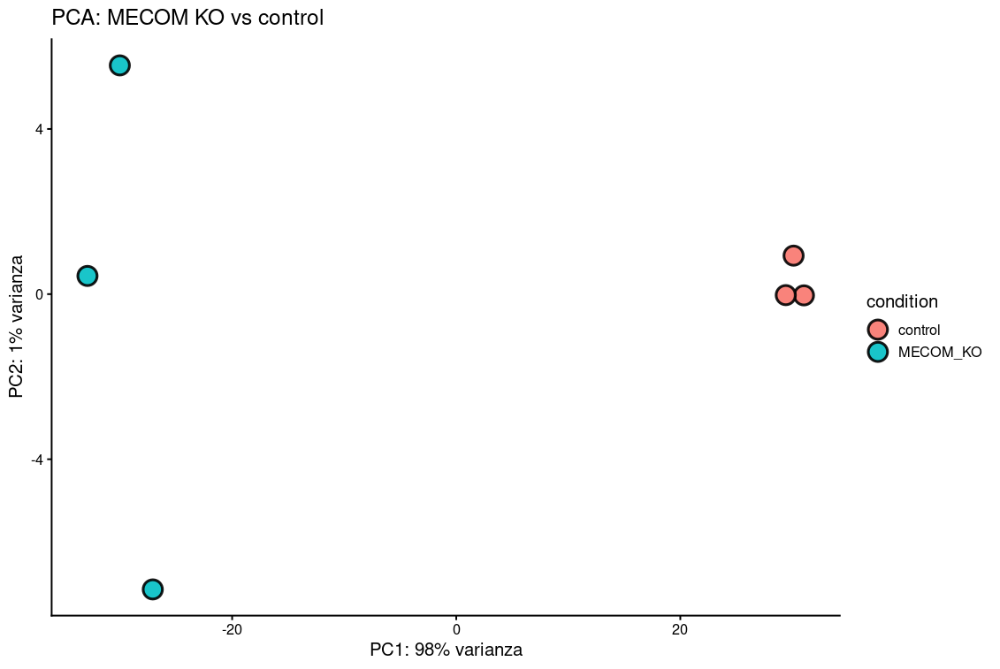
<p><b>Figura 7.</b> Análisis de componentes principales (PCA).</p>
</div> 

</div>

')
```

El análisis de componentes principales (PCA) permitió explorar las principales fuentes de variación presentes en los datos y evaluar el agrupamiento de las muestras de acuerdo con su condición experimental. Se observa una separación entre los grupos control y MECOM KO, lo que indica que la condición experimental constituye una fuente importante de variación en el conjunto de datos.

Los dos primeros componentes principales explican conjuntamente aproximadamente el 99% de la varianza total. Además, las muestras control se agrupan en un clúster más compacto, lo que sugiere una mayor similitud entre sus perfiles de expresión génica. En contraste, las muestras MECOM KO presentan una dispersión mayor, indicando una variabilidad más elevada entre ellas. Esta heterogeneidad podría reflejar diferencias biológicas entre las muestras o variación técnica.

##### *Volcano Plot*

En esta sección se generan volcano plots mediante la función EnhancedVolcano, con el objetivo de visualizar los genes diferencialmente expresados entre las condiciones MECOM KO y control. La gráfica representa en el eje X el log2 fold change (log2FC) y en el eje Y el p-value ajustado −log10(padj).

Se establecen como criterios de selección un p-value ajustado menor a 0.05 (pCutoff = 0.05) y un log2 fold change superior a 1 en su valor absoluto. Con base en estos umbrales, los genes se clasifican en cuatro categorías: genes significativos tanto por valor p-value ajustado como log2 fold change (rojo), genes que cumplen únicamente el criterio de log2 fold change (verde), genes que cumplen únicamente el criterio de p-value ajustado (azul) y genes que no cumplen ninguno de los criterios establecidos (gris).

```{r}
# EnhancedVolcano(deseq_Results,
#                 lab = deseq_Results$symbol,
#                 x = 'log2FoldChange',
#                 y = 'padj',
#                 title = 'MECOM KO vs control',
#                 subtitle = "Reference= control",
#                 labSize = 3.0,
#                 pCutoff = 0.05,
#                 FCcutoff = 1
# ) 
# 
# 
# EnhancedVolcano(
#   deseq_Results,
#   lab = deseq_Results$symbol,
#   x = 'log2FoldChange',
#   y = 'padj',
#   title = 'MECOM KO vs control',
#   subtitle = "Reference = control",
#   labSize = 5,              # aumentar tamaño
#   pCutoff = 0.05,
#   FCcutoff = 1,
#   selectLab = c("MECOM"),
#   
#   boxedLabels = TRUE,       # poner etiqueta en caja
#   drawConnectors = TRUE,    # línea al punto
#   widthConnectors = 0.8
# )
```

```{r, echo=FALSE, results='asis'}
cat('
<div style="display:flex; justify-content:center; gap:30px;">

<div style="text-align:center;">
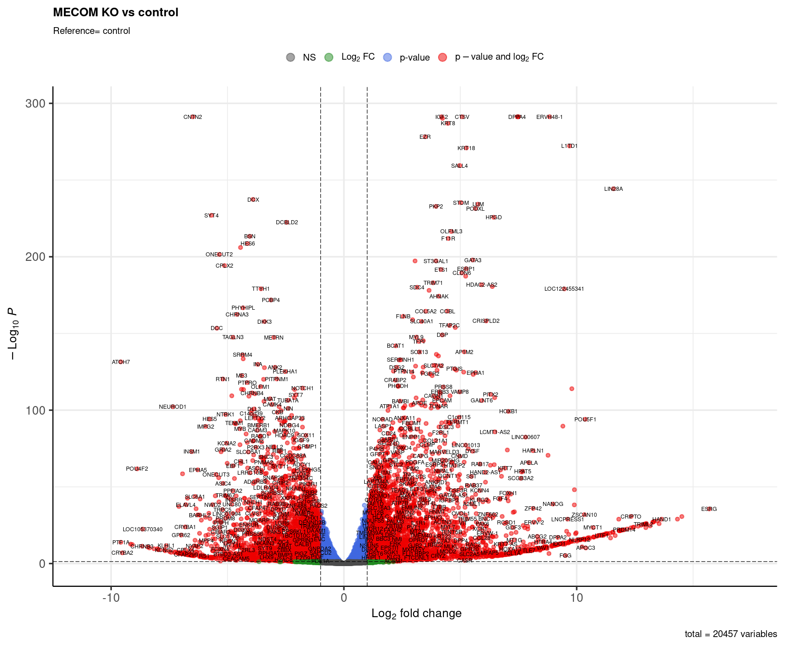
<p><b>Figura 8A.</b> Volcano plot. </p>
</div> 

</div>  

<div style="display:flex; justify-content:center; gap:30px;">

<div style="text-align:center;">
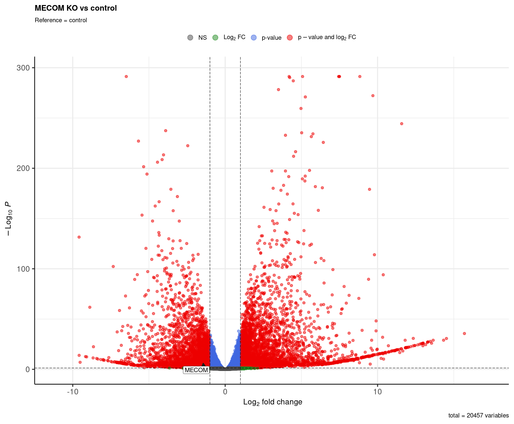
<p><b>Figura 8B.</b> Volcano plot con énfasis en el gen MECOM. </p>
</div> 

</div>


')
```

Como resultado del análisis de expresión diferencial se obtuvieron volcano plots que permitieron visualizar los genes diferencialmente expresados entre las condiciones MECOM KO y control. Se identificó un total de 7,307 genes que cumplieron con los criterios de significancia estadística (p-value ajustado \< 0.05) y magnitud de cambio de expresión (\|log2 fold change\| \> 1) previamente establecidos. De estos genes, 3,597 se encontraron sobreexpresados y 3,710 subexpresados en la condición MECOM KO con respecto al grupo control, como se muestra en la Figura 7A.

Adicionalmente, se exploró la expresión del gen MECOM debido a que corresponde al gen con el knockout en nuestras muestras experimentales. Dado el diseño del estudio, se esperaba observar una disminución en su expresión, lo cual fue consistente con los resultados obtenidos (Figura 7B). En particular, MECOM presentó un valor de p ajustado de 8.11 × 10⁻⁶ y un log2 fold change de −1.35, indicando una reducción significativa de su expresión en la condición MECOM KO en comparación con el grupo control. Estos resultados son consistentes con el contexto biológico.

##### *Heat map*

En esta sección se genera un heat map para explorar los patrones de expresión de un conjunto de genes marcadores asociados a distintos tipos celulares de la retina. El objetivo es evaluar si la condición MECOM KO presenta cambios característicos en la expresión de estos marcadores en comparación con las muestras control.

Para ello, se parte de los resultados previamente anotados del análisis de expresión diferencial y se selecciona un conjunto de genes de interés reportados en el paper asociado a los datos. Posteriormente, se extraen sus valores de expresión a partir de la matriz transformada mediante VST. Los niveles de expresión se estandarizan (z-score). Finalmente, se construye un heatmap con clustering jerárquico tanto de genes como de muestras. Esta visualización permite identificar patrones de coexpresión, agrupamientos de muestras y posibles cambios asociados a la pérdida de MECOM.

```{r}
# library(pheatmap)
# library(dplyr)
# library(tibble)
# 
# volcano_df <- read.csv(
#   "./DEA_MECOM_KO_vs_control.csv",
#   row.names = 1
# )
# 
# volcano_df$gene_id <- rownames(volcano_df)
# 
# volcano_df$label <- ifelse(
#   is.na(volcano_df$symbol),
#   volcano_df$gene_id,
#   volcano_df$symbol
# )
# 
# genes_interest <- c(
#   "MECOM",
#   "ZIC1",
#   "CPAMD8",
#   "SOX2",
#   "ASCL1",
#   "POU4F2",
#   "NEFM",
#   "ONECUT3",
#   "PROX1",
#   "PCP2",
#   "VSX1",
#   "RCVRN",
#   "CRX",
#   "PDE6C",
#   "NRL",
#   "RLBP1",
#   "CA2"
# )
#
# selected_genes <- volcano_df %>%
#   filter(symbol %in% genes_interest)
# 
#
# gene_ids <- selected_genes$gene_id
# 
#
# mat_sel <- assay(vds)[gene_ids, ]
# 
#
# rownames(mat_sel) <- selected_genes$symbol
# 
#
# mat_sel_scaled <- t(scale(t(mat_sel)))
# 
#
# annotation_col <- data.frame(
#   condition = vds$condition
# )
# 
# rownames(annotation_col) <- colnames(mat_sel_scaled)
# 
#
# pheatmap(
#   mat_sel_scaled,
#   annotation_col = annotation_col,
#   show_rownames = TRUE,
#   fontsize_row = 10,
#   fontsize_col = 10,
#   cluster_rows = TRUE,
#   cluster_cols = TRUE,
#   scale = "none",
#   main = "Selected genes: MECOM KO vs control"
# )
# 
# 
# setdiff(genes_interest, volcano_df$symbol)
```

```{r, echo=FALSE, results='asis'}
cat('
<div style="display:flex; justify-content:center; gap:30px;">

<div style="text-align:center;">
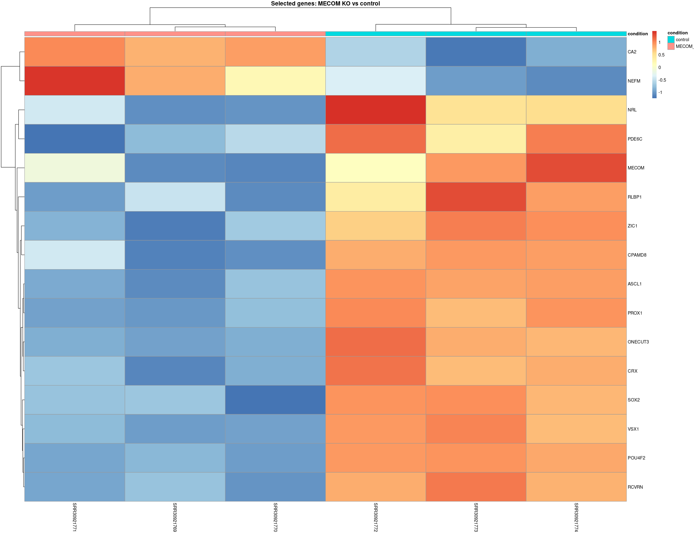
<p><b>Figura 9.</b> Heat map de genes marcadores de la retina.</p>
</div> 

</div>

')
```

El heatmap muestra un agrupamiento de las muestras que coincide con la condición experimental, observándose dos clústeres principales correspondientes a los grupos control y MECOM KO. Esta separación sugiere que la pérdida de MECOM está asociada con cambios consistentes en la expresión de los genes marcadores seleccionados.

En general, las muestras control presentan niveles relativos de expresión más altos para la mayoría de los marcadores retinianos analizados, mientras que las muestras MECOM KO muestran una disminución relativa de la expresión de estos genes. Este patrón es consistente en gran parte de los marcadores incluidos en el análisis, lo que sugiere una posible alteración de programas transcripcionales asociados a diferentes tipos celulares de la retina. Sin embargo, algunos genes, como CA2 y NEFM, no siguen claramente esta tendencia general. Adicionalmente, el gen PCP2 no fue identificado en el conjunto de datos analizado, por lo que no pudo incluirse en la visualización.

### *Análisis de enriquecimiento*

En esta sección se utilizan los resultados del análisis de expresión diferencial para identificar procesos biológicos y funciones moleculares asociados a los cambios observados entre las condiciones MECOM KO y control. Para ello, se cargan los resultados de DESeq2 y se construye una lista ordenada de genes utilizando el log2 fold change como métrica de clasificación. Posteriormente, se realiza un Gene Set Enrichment Analysis (GSEA) mediante la función gseGO del paquete clusterProfiler.

El análisis se realizó utilizando las anotaciones de Gene Ontology (GO) disponibles en la base de datos org.Hs.eg.db, considerando las tres categorías principales de GO: procesos biológicos (BP), funciones moleculares (MF) y componentes celulares (CC) (ont = "ALL"). Se empleó la corrección por pruebas múltiples de Benjamini-Hochberg y un valor de corte de significancia de 0.05. Finalmente, los términos enriquecidos se visualizaron mediante un dotplot, separando los procesos enriquecidos positivamente y negativamente según la dirección del enriquecimiento observada en la comparación MECOM KO versus control.

```{r}
#  
# dea <- read.csv("./DEA_MECOM_KO_vs_control.csv")
# 
# library(R.utils)
# # R.utils::setOption("clusterProfiler.download.method","wget")# Load libraries
# library(DOSE)
# library(pathview)
# library(ggnewscale)
# library(org.Rn.eg.db)
# library(tidyverse) 
# library(clusterProfiler)
# library(enrichplot)
# library(ggplot2)
# 
# str(dea)
# names(dea) 
# rownames(dea)<- dea$X  
# dea<- dea[,-1]
# res_table <- dea %>%
#   data.frame() %>%
#   rownames_to_column(var="gene") %>%
#   as_tibble() 
# 
# 
# 
# res_table <- dea %>%
#   data.frame() %>%
#   tibble::rownames_to_column(var = "gene") %>%
#   as_tibble()
# 
# 
# res_table <- dplyr::filter(
#   res_table,
#   !is.na(log2FoldChange)
# )
# 
# 
# gene_list <- res_table$log2FoldChange
# names(gene_list) <- res_table$gene
# 
# 
# gene_list <- sort(gene_list, decreasing = TRUE)
# 
# 
# gse <- gseGO(
#   geneList = gene_list,
#   ont = "ALL",
#   keyType = "ENSEMBL",
#   OrgDb = org.Hs.eg.db,
#   pAdjustMethod = "BH",
#   pvalueCutoff = 0.05,
#   minGSSize = 10,
#   maxGSSize = 800,
#   verbose = TRUE
# )
# 
# 
# p_gsea <- dotplot(
#   gse,
#   showCategory = 15,
#   split = ".sign"
# ) +
#   facet_grid(. ~ .sign) +
#   theme_bw(base_size = 12) +
#   theme(
#     axis.text.y = element_text(size = 7)
#   ) +
#   ggtitle("GSEA GO: MECOM KO vs control")
# 
# p_gsea

```

```{r, echo=FALSE, results='asis'}
cat('
<div style="display:flex; justify-content:center; gap:30px;">

<div style="text-align:center;">
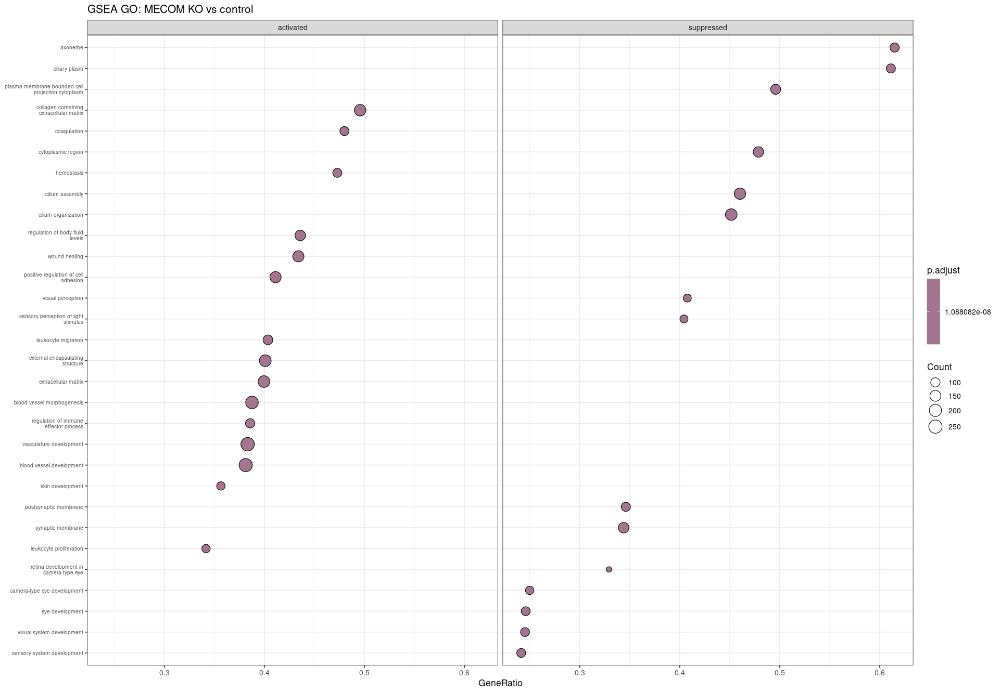
<p><b>Figura 10.</b> Dot plot.</p>
</div> 

</div>

')
```

El Gene Set Enrichment Analysis reveló alteraciones importantes en procesos biológicos asociados al desarrollo y función de la retina (Figura 9). Entre los procesos suprimidos, destacan visual system development, eye development, camera-type eye development, retina development in camera-type eye, sensory system development, visual perception y sensory perception of light stimulus. Estos resultados son consistentes con los observados en el heatmap de genes marcadores de la retina, donde la mayoría de los genes asociados a diferentes tipos celulares de la retina mostraron una disminución relativa de su expresión en las muestras MECOM KO.

Por otra parte, entre los procesos enriquecidos positivamente se encuentran positive regulation of cell adhesion, extracellular matrix organization, blood vessel morphogenesis, vasculature development, blood vessel development y skin development.

## **Discusión**

Los resultados correspondientes a este conjunto de datos se encuentran descritos en el artículo original dentro de la sección Cellular and molecular dynamics underlying NR repair y en la Figura S13 del material suplementario, la cual se incluye en este trabajo como Figura 10 para facilitar la comparación.

En la Figura 10D se presenta el volcano plot obtenido en el estudio original. Al compararlo con nuestros resultados, observamos una alta concordancia en los patrones de expresión diferencial identificados. En particular, el gen MECOM, que corresponde al gen con el knockout en las muestras experimentales, muestra una disminución significativa de su expresión en la condición knockout respecto al control, reproduciendo la tendencia reportada por los autores.

Por otra parte, el análisis del heatmap revela patrones de agrupamiento similares a los observados en el artículo (figura 10C). Las muestras se separan de acuerdo con la condición experimental, formando clústeres diferenciados para los grupos control y MECOM KO. Asimismo, la mayoría de los genes marcadores de retina presentan niveles relativos de expresión más altos en las muestras control que en las muestras knockout. Este patrón es consistente con el descrito en el trabajo original, con algunas excepciones, como los genes CA2 y NEFM, que muestran un comportamiento diferente al observado para la mayoría de los marcadores analizados.

Finalmente, el análisis de enriquecimiento funcional mediante GSEA también mostró resultados concordantes con los reportados en el artículo. Tanto en nuestros resultados como en los del estudio original se observa un enriquecimiento negativo de procesos relacionados con el desarrollo y la función visual, incluyendo procesos asociados al desarrollo de la retina y la percepción de estímulos luminosos. En contraste, se detectó un enriquecimiento positivo de procesos relacionados con el desarrollo vascular y la organización tisular. Lo cual es consistente entre ambos análisis. En conjunto, los resultados obtenidos reproducen los principales hallazgos reportados en el artículo original, tanto a nivel de genes diferencialmente expresados como de patrones de expresión y procesos biológicos enriquecidos.

Adicionalmente, diversos estudios respaldan la relevancia biológica de MECOM en el desarrollo y mantenimiento de la retina. Eldred et al. identificaron a MECOM como uno de los genes marcadores clave de las células progenitoras tempranas presentes en la zona marginal ciliar (CMZ) de la retina fetal humana. De manera consistente, Zuo et al. incluyeron a MECOM dentro de una red de factores de transcripción fundamentales asociados con el desarrollo y la diferenciación de células progenitoras de la retina. Por su parte, Mao et al. describieron que MECOM participa en procesos de remodelación de la cromatina y represión transcripcional. Esto muestra que la expresion de MECOM es crítica durante la progresión y diferenciación de células progenitoras de la retina.

En conjunto, estos antecedentes fortalecen la interpretación de los resultados observados tanto en nuestro análisis como en el articulo original. La disminución de la expresión de MECOM no solo fue consistente con el diseño experimental, sino que además se acompañó de alteraciones en genes marcadores de retina y en procesos biológicos relacionados con el desarrollo y la función visual. Esto sugiere que MECOM desempeña un papel relevante en la regulación de programas transcripcionales asociados a distintos tipos celulares de la retina y al mantenimiento celular durante el desarrollo de la retina.

No obstante, este trabajo también presenta limitaciones. A pesar de la evidencia disponible, muchas de las funciones específicas de MECOM en los distintos contextos celulares de la retina aún no se comprenden completamente. Por ello, serán necesarios estudios adicionales que permitan caracterizar con mayor detalle los mecanismos moleculares regulados por este factor de transcripción y su contribución a la biología de las células progenitoras de la retina.

```{r, echo=FALSE, results='asis'}
cat('
<div style="display:flex; justify-content:center; gap:30px;">

<div style="text-align:center;">
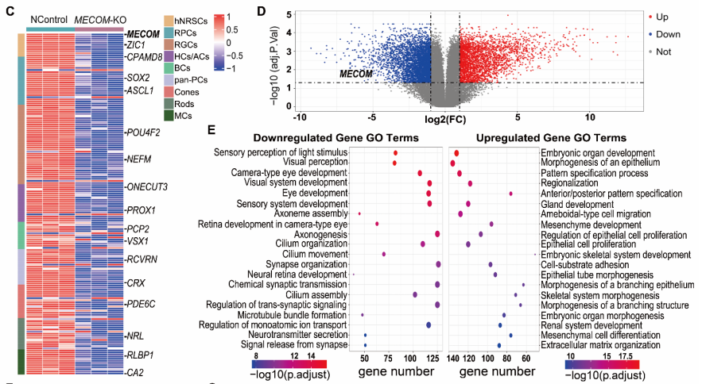
<p><b>Figura 11.</b> Resultados del Artículo original.</p>
</div> 

</div>

')
```

## **Referencias**

-   Liu, H., Ma, Y., Gao, N., Zhou, Y., Li, G., Zhu, Q., Liu, X., Li, S., Deng, C., Chen, C., Yang, Y., Ren, Q., Hu, H., Cai, Y., Chen, M., Xue, Y., Zhang, K., Qu, J., & Su, J. (2025). Identification and characterization of human retinal stem cells capable of retinal regeneration. *Science Translational Medicine*, *17*(791), eadp6864. <https://doi.org/10.1126/scitranslmed.adp6864>
-   Analysis workflow. (s. f.). <https://biocorecrg.github.io/RNAseq_course_2019/workflow.html>
-   Eldred, K. C., Edgerton, S. J., Ortuño-Lizarán, I., Wohlschlegel, J., Sherman, S. M., Petter, S., Wyatt-Draher, G., Hoffer, D., Glass, I., La Torre, A., & Reh, T. A. (2025). Ciliary marginal zone of the developing human retina maintains retinal progenitor cells until late gestational stages. *Cell Reports*, 44(4), 115460. <https://doi.org/10.1016/j.celrep.2025.115460>
-   Mao, X., An, Q., Xi, H., Yang, X., Zhang, X., Yuan, S., Wang, J., Hu, Y., Liu, Q., & Fan, G. (2019). Single-Cell RNA Sequencing of hESC-Derived 3D Retinal Organoids Reveals Novel Genes Regulating RPC Commitment in Early Human Retinogenesis. *Stem Cell Reports*, 13(4), 747-760. <https://doi.org/10.1016/j.stemcr.2019.08.012>
-   Zuo, Z., Cheng, X., Ferdous, S., Shao, J., Li, J., Bao, Y., Li, J., Lu, J., Lopez, A. J., Wohlschlegel, J., Prieve, A., Thomas, M. G., Reh, T. A., Li, Y., Moshiri, A., & Chen, R. (2024). Single cell dual-omic atlas of the human developing retina. *Nature Communications*, 15(1), 6792. <https://doi.org/10.1038/s41467-024-50853-5>
